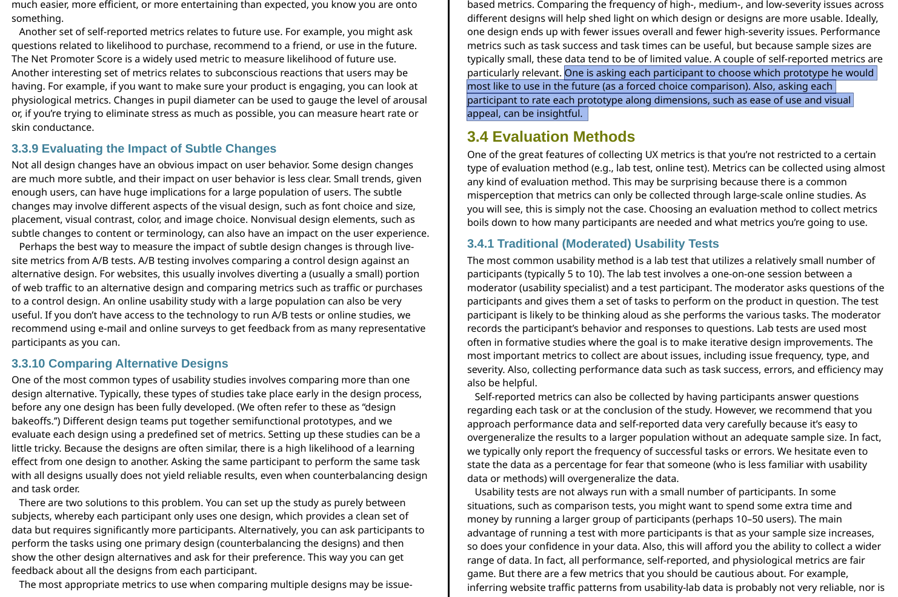

# Presentation website

Please find the interactive version of the presentation here:

[https://lucah.tech/prototyping/index.html](https://lucah.tech/prototyping/index.html)

Or scan the following QR code:

Or see the source-code on GitHub:

[https://github.com/quoteme/prototyping](https://github.com/quoteme/prototyping)

# Presentation notes

## Motivation

- large field / may become its own course in the coming years
  - 

## Part of various design paradigms

- UCD (User-Centered Design)
- reason:
  - Reminder: “User-centered design (UCD) describes a process that generates products and
    services with a high degree of User Experience (UX) by focusing on gaining a deep
    understanding of users.“ (Weichert et al. 2019)
  - Prototyping involves users in the design process
- 
  - reminder:
    - develop various _prototpyes_
    - use prototypes to _communicate_ with
      - stakeholders
      - participants
      - decision-makers
      - users
    - develop _common understanding_
- also 
  - reminder:
    - use prototypes for _usability testing_
    - _actual users_ test the prototypes
    - in _realistic scenarios_
- 
  - reminder:
    - designed to improve _innovation_
- 
  - reminder:
    - _iterative_ development
    - _incremental_ development
    - _flexible_ development

## Takes different forms [^1]

- **Proof-of-Principle Prototype**: Verifies key functions
- **Working Prototype**: Near-final functionality
- **Visual Prototype**: Shows size, appearance
  - **Form Study Prototype**: Emphasizes geometry & less color/material
- **User Experience Prototype**: For user research
  - **Usability Testing**
  - **Realistic Interactions**
  - **Feedback Collection**
  - **Iterative Improvement**
  - **User-Centered Design**
- **Functional Prototype**:
  - Shows function, appearance / not final scale, manufacturability, ...
- **Paper Prototype**:
  - Early UI testing on paper. Confirm and communicate design ideas

### Bias

## Measuring the user experience

[^2]

### Formative effects of prototyping

- reminder:

  - "To find out _improvement areas_ prior to release" (`03_UXDM.pdf`)
    - 

- Key Questions & Answers:
  - **What usability issues block user goals?**  
    _Discover issues through prototype testing_
  - **What aspects work well or frustrate?**  
    _Observe user interactions with prototypes_
  - **What common errors are users making?**  
    _Identify errors in prototype use_
  - **What issues may remain post-launch?**  
    _Predict challenges from prototype feedback_
  - **How can prototypes enhance understanding?**  
    _Use prototypes to align with users_
  - **What feedback can improve design?**  
    _Iterate based on prototype insights_

### Summative effects of prototyping

- reminder:

  - "To determine the _quality of UX_ against a set of criteria" (`03_UXDM.pdf`)
    - 

- Key Questions & Answers:
  - **Did we meet UX/usability goals?**  
    _Verify goals using final prototype tests_
  - **What is the overall UX quality?**  
    _Evaluate user experience with polished prototype_
  - **How does our product compare?**  
    _Benchmark prototype against competitor models_
  - **Have we improved since last release?**  
    _Compare current prototype to prior versions_

## Applications of prototypes

- comparing designs
  - 
- online surveys
  - 
  - [^3]
- performance metrics
  - user efficiency
    - [^4]
    - [^4]
- testing
  - user success in A/B testing
    - [^4]
    - [^4]

### Märchenstunde dazu

- Prototype of a high-voltage detector
- Phase 2/4 UCD
  - Discussion with developers
    - 
    - If wrong LED is on, user could die
  - Developers did _not want to change_ LEDs
- Phase 3/4 UCD
  - Prototyp has been build
    - **Simulates** 20% probability, measured object is high voltage
- Phase 4/4 UCD
  - 100 Participants
  - One misinterpretation

#### Resultat

Developers got convinced to change LEDs

---

[^1]: Lai, Chun Sing; Locatelli, Giorgio (February 2021). "Valuing the option to prototype: A case study with Generation Integrated Energy Storage" (PDF). Energy. 217: 119290. doi:[10.1016/j.energy.2020.119290](https://doi.org/10.1016%2Fj.energy.2020.119290).

[^2]: Thomas Tullis, William Albert, Interactive technologies Elsevier / Morgan Kaufmann, (2013) ISBN:0124157815,9780124157811,0124157920,9780124157927

[^3]: Thomas Tullis, William Albert, Interactive technologies Elsevier / Morgan Kaufmann, (2013) ISBN:0124157815,9780124157811,0124157920,9780124157927 - chapter 3

[^4]: Thomas Tullis, William Albert, Interactive technologies Elsevier / Morgan Kaufmann, (2013) ISBN:0124157815,9780124157811,0124157920,9780124157927 - chapter 4

[^5]: Tullis, T. S. (2011). Worst usability issue. Posted July 4, 2011. [http:/www.measuringux.com/WorstUsabilityIssue/](http:/www.measuringux.com/WorstUsabilityIssue/)
